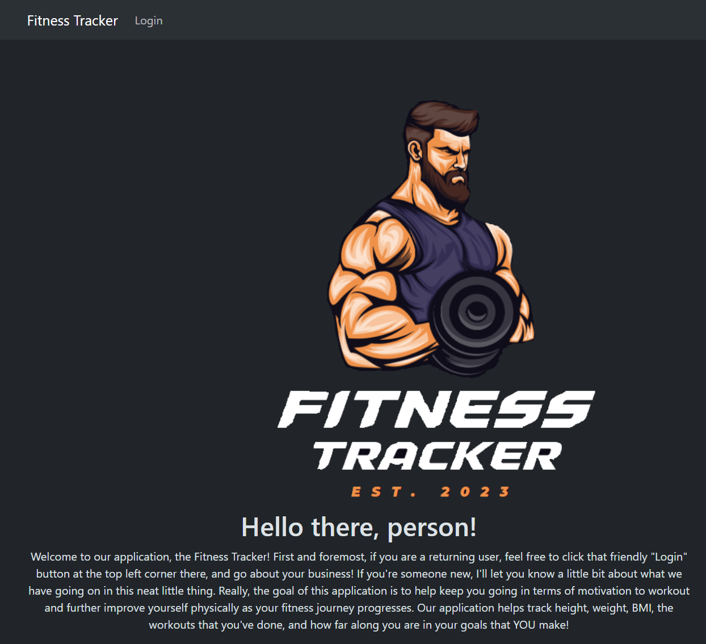

# **Fitness Tracker**

## Description

This MERN app was created to help keep track of your fitness goals and workouts. Making use of RESTful API's, the user is able to send data to a database and the website will track and render that data out across the app. React, Bootstrap, Express, and Mongo were the major tech stack elements used to create the application.

## Installation

Heroku was the hosting service that made the most sense for this project. You can find the deployed version here: [Fitness Tracker](https://fitness-tracker-server-44fdd70c95d7.herokuapp.com/)

## Preview 

The image listed below provides a look at what the homepage looks like for a non-logged-in user: 

## Credits 

Shahan Ameen
gitHub link: https://github.com/ShahanAmeen

Zack Schreier
gitHub link: https://github.com/ZSchreier

Jason Yang
gitHub link: https://github.com/Jasony95

Casey Doig
gitHub link: https://github.com/cddoigkn

Yacob Menghistu
github link: https://github.com/YacobMn

## License 

No license